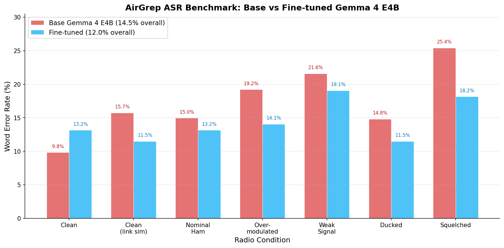

# AirGrep

Radio-frequency monitoring with real-time ASR and intelligent alerting, powered by a fine-tuned Gemma 4 E4B.

## Architecture

```
RTL-SDR  -->  IQ capture  -->  FM demod / filter / decimate  -->  WAV
                                                                   |
                          Gemma 4 E4B (audio-LoRA fine-tune)  <----+
                                   |
                            Pass 1: ASR transcription
                                   |
                            Pass 2: evaluation + tool call
                                   |
                              alert_user() --> TUI feed
```

A single fine-tuned Gemma 4 E4B instance handles both passes. The audio-encoder LoRA was trained on LibriSpeech + synthetic radio-degradation augmentation (NBFM, weak signal, overmodulation, squelch, ducking).

## Fine-tune details

| Metric | Value |
|--------|-------|
| Base model | Gemma 4 E4B |
| Method | Audio-encoder LoRA |
| Trainable params | 7.02M (0.09% of total) |
| Training data | LibriSpeech clean-100 + radio augmenter |
| Hardware | 1x RTX 3090, 8.8 hours |
| Val loss | 0.340 -> 0.297 |

Full training results: [`finetune/README.md`](finetune/README.md)

## ASR Benchmark

Word Error Rate across 7 radio conditions (35 clips, LibriSpeech + synthetic radio augmentation):



| Condition | Base Gemma 4 E4B | Fine-tuned | Improvement |
|-----------|:----------------:|:----------:|:-----------:|
| Clean | 9.8% | 13.2% | -3.4% |
| Clean (link sim) | 15.7% | 11.5% | +4.2% |
| Nominal Ham | 15.0% | 13.2% | +1.8% |
| Overmodulated | 19.2% | 14.1% | +5.1% |
| Weak Signal | 21.6% | 19.1% | +2.5% |
| Ducked | 14.8% | 11.5% | +3.3% |
| Squelched | 25.4% | 18.2% | +7.2% |
| **Overall** | **14.5%** | **12.0%** | **+2.5%** |

The fine-tune shows the largest gains on the most degraded conditions (squelched: 7.2% improvement, overmodulated: 5.1%), which are the conditions that matter most for real-world radio monitoring. The slight regression on clean audio (3.4%) is expected -- the LoRA trades clean-speech specialization for robustness to radio artifacts.

Reproduce with: `python benchmark.py` (fine-tuned) and `python benchmark.py --model-path google/gemma-4-E4B-it` (base).

## Quickstart

Full setup — Python env, CUDA vs CPU torch, RTL-SDR / Zadig on Windows,
memory-footprint tuning — is in [INSTALL.md](INSTALL.md).  The TL;DR:

```bash
pip install -r requirements.txt
# (plus the right torch for your GPU, see INSTALL.md §2)

# First run auto-downloads weights from HuggingFace (~16 GB,
# wames123/airgrep-asr-gemma-4-e4b).

# Demo mode (no SDR dongle needed — uses a bundled WAV):
python app.py --demo samples/00_2277-149896-0000_02_nominal_ham.wav

# Live monitoring on a single frequency (needs an RTL-SDR dongle):
python app.py -f 144.35 --watch "emergency alerts, callsigns"

# Wideband FFT sweep across a range:
python app.py -f 144-148 --watch "emergencies"

# Headless (no TUI):
python pipeline.py -f 162.4 --watch "weather alerts"

# ASR benchmarks:
python benchmark.py
```

**`app.py` vs `pipeline.py`:** `app.py` is the interactive Textual TUI —
use this for demos and day-to-day monitoring (live transcripts feed,
alert log overlay, retune/watch editing without restart). `pipeline.py`
is a headless equivalent that prints to the console — useful for
long-running background monitoring, scripting, or environments without
a TTY.

Memory tuning:

- `--max-gpu-memory <size>` — caps VRAM use; remainder spills to CPU RAM
  (see [INSTALL.md §7](INSTALL.md#7-memory-notes))
- `--cpu` — runs without a GPU; only practical for `--demo` against pre-captured
  WAVs, requires ≥ 32 GB system RAM

## Model weights

The fine-tuned checkpoint is hosted on HuggingFace as
[`wames123/airgrep-asr-gemma-4-e4b`](https://huggingface.co/wames123/airgrep-asr-gemma-4-e4b)
and is the default `--model-path` for every AirGrep command. Transformers
will download it automatically on first run (~16 GB, cached in
`~/.cache/huggingface/`).

To use a local checkpoint instead:

```bash
python app.py --model-path /path/to/checkpoint -f 144.35
```

## Key features

- **Continuous capture**: ring-buffer SDR capture runs independently of LLM analysis
- **Signal-gated pipeline**: pre-LLM RMS energy check skips silence instantly (no wasted GPU cycles)
- **Wideband FFT scan**: sweeps 4 MHz in ~75 ms via FFT power detection (vs ~10 s per-channel)
- **Tool-calling evaluation**: Pass 2 uses `alert_user(message, urgency)` tool calls -- no regex parsing
- **Edge-friendly**: runs locally on a single 16 GB consumer GPU — no cloud, no telemetry

## Repo structure

```
app.py            TUI application (Textual)
pipeline.py       Headless monitor (no TUI)
llm.py            Gemma 4 E4B inference (ASR + evaluation)
capture.py        SDR IQ capture, FM demod, FFT scan
benchmark.py      ASR Word Error Rate benchmark
samples/          Benchmark clips (7 radio conditions x 5 utterances)
docs/benchmark/   Benchmark results + chart + plotting script
finetune/         Training scripts, augmenter, results writeup
  train.py          LoRA fine-tuning script
  train_dataset.py  LibriSpeech + augmentation dataset
  radio_augment.py  Radio degradation augmenter
  merge_adapter.py  LoRA merge utility (bf16 sharded save)
  README.md         Full fine-tune results writeup
dev/              Historical diagnostic/data-prep scripts (not used at runtime)
```

## License

AirGrep source code is MIT-licensed (see [LICENSE](LICENSE)).

The fine-tuned model weights inherit Gemma 4's
[Apache 2.0 license](https://www.apache.org/licenses/LICENSE-2.0).
Gemma is a trademark of Google LLC.
